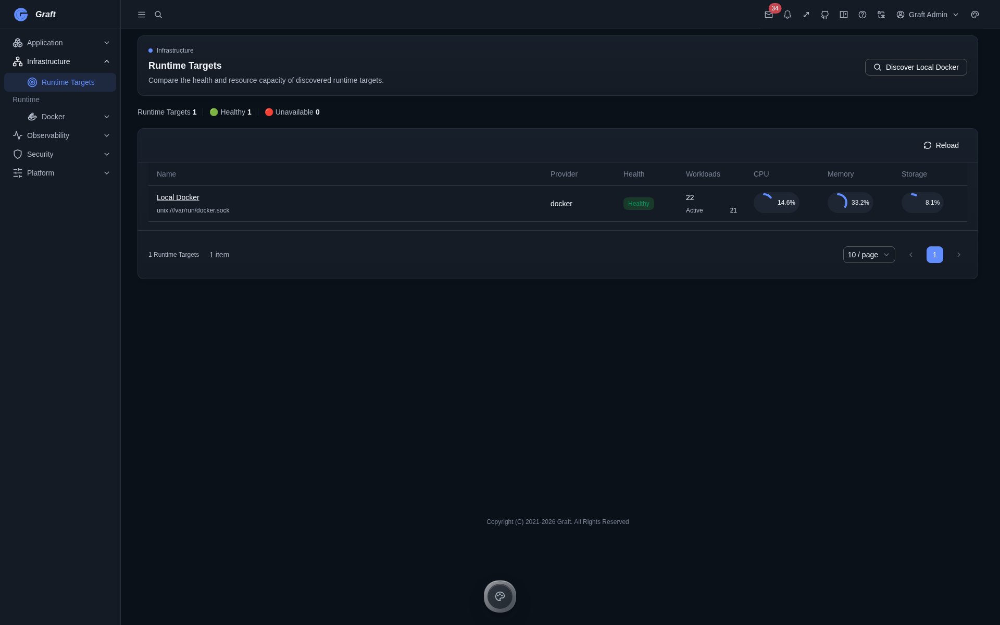
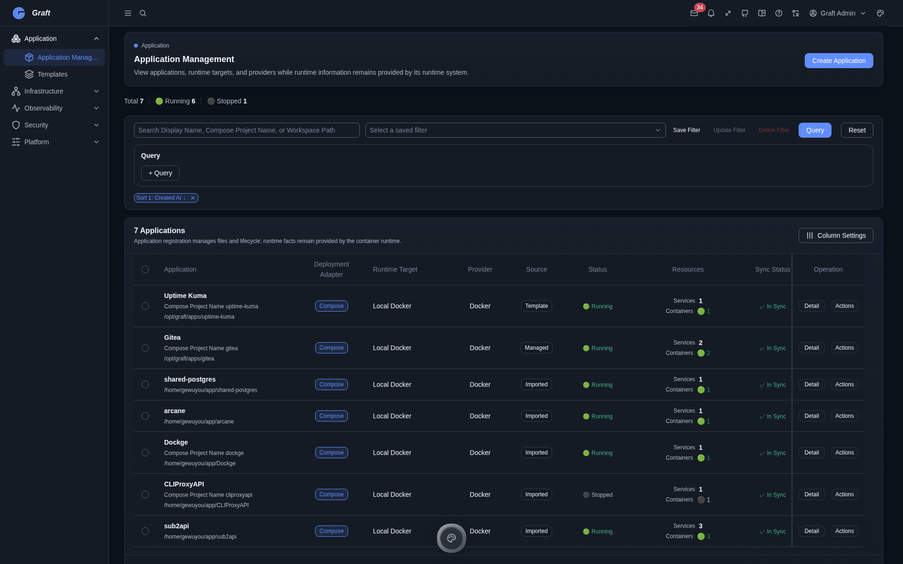
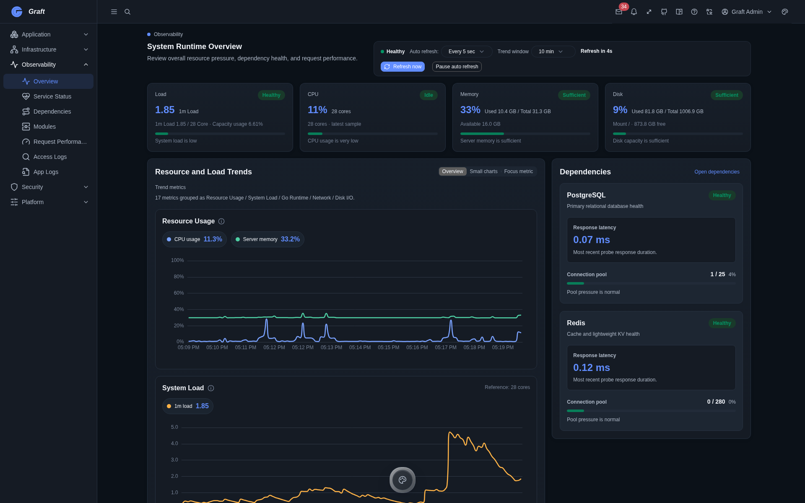
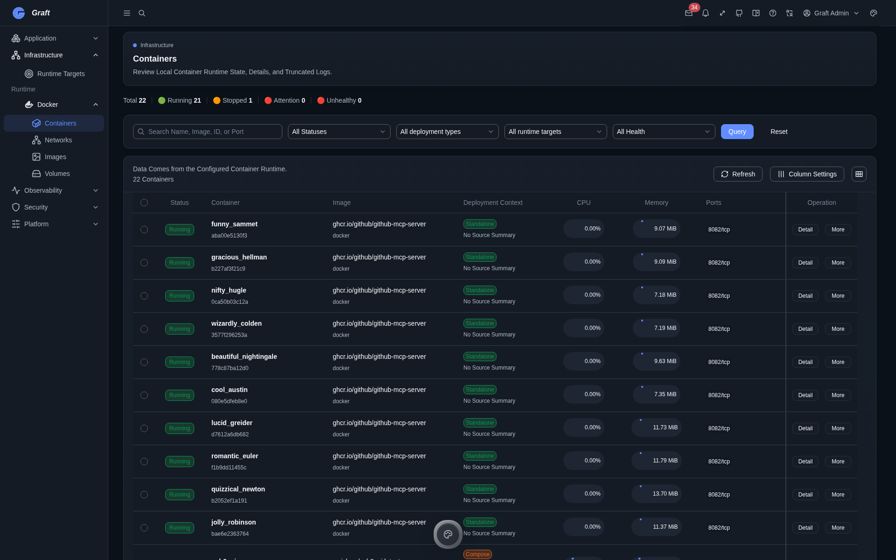

<p align="center">
  
</p>

<h1 align="center">Graft</h1>

<p align="center"><strong>A self-hosted application platform.</strong></p>

<p align="center">Manage Compose applications, their Docker runtime, and the operational signals around them from one place.</p>

<p align="center">
  <a href="https://github.com/GeWuYou/Graft/tags"></a>
  <a href="LICENSE"></a>
  
  
</p>

<p align="center"><a href="README.zh-CN.md">简体中文</a> · <a href="#quick-start">Quick start</a> · <a href="#documentation">Documentation</a> · <a href="#contributing">Contributing</a></p>



## What is Graft?

Graft is a self-hosted application platform for teams that run Compose applications on Docker. It keeps application records, runtime targets, container resources, and operational views in a single admin surface instead of scattering them across separate tools.

Its current deployment adapter is Compose and its current runtime target is Local Docker. Those boundaries are deliberate: Graft does not present unfinished providers as supported integrations.

## Highlights

|                          |                                                                                                                                                      |
| ------------------------ | ---------------------------------------------------------------------------------------------------------------------------------------------------- |
| **Application first**    | Register, create, import, template, configure, and operate Compose applications as application-level resources.                                      |
| **Unified runtime**      | Connect application records to a Local Docker target and inspect containers, images, networks, volumes, events, logs, and controlled shell sessions. |
| **Observability**        | Review runtime health, resource trends, dependencies, request performance, access logs, application logs, and audit events.                          |
| **OpenAPI first**        | OpenAPI 3.1 is the shared API contract; the web client generates its API types from that source.                                                     |
| **Developer experience** | Go modules, a Vue 3 admin shell, explicit runtime wiring, and Compose deployment keep the extension path visible.                                    |

## Why Graft?

Graft treats Docker and Compose as runtime capabilities, not as the product boundary. The application remains the unit you manage; runtime state and observability remain connected to it.

| Layer           | Current responsibility                                                                                    |
| --------------- | --------------------------------------------------------------------------------------------------------- |
| **Application** | Compose application records, templates, lifecycle actions, configuration workspace, and application logs. |
| **Runtime**     | Local Docker discovery, resource inventory, runtime health, container actions, and real-time signals.     |
| **Platform**    | Authentication, RBAC, audit, scheduler, notifications, system configuration, and OpenAPI contracts.       |

## Quick Start

Graft publishes server and web images to GHCR. A Docker host with Docker Compose is required.

```bash
git clone https://github.com/GeWuYou/Graft.git
cd Graft
cp compose.env.example .env
# Set strong values for POSTGRES_PASSWORD and GRAFT_AUTH_JWT_SECRET in .env.
# GRAFT_IMAGE_TAG selects the shared official server/web version: latest, beta, or a fixed release tag such as v1.2.3.
docker compose pull
docker compose up -d
```

Open [http://localhost:3000](http://localhost:3000). The Compose stack brings up PostgreSQL and Redis, runs database migrations through the one-shot bootstrap service, then starts the server and web services.

On the first sign-in, use the default administrator credentials `graft` / `graft-admin`. Graft requires this initial password to be changed before the admin shell can be used.

For local development, use the source-tree entrypoints:

```bash
# Terminal 1
cd server
# First run only: cp .env.example .env
# After an upgrade: go run ./cmd/graft config validate --format patch
go run ./cmd/graft dev

# Terminal 2
cd web
bun run dev
```

See the [deployment configuration template](compose.env.example) and [Compose topology](compose.yml) before exposing an instance outside localhost. `GRAFT_IMAGE_TAG` is the single image-version setting for the official server and web images; use `latest`, `beta`, or a fixed release tag. For `latest` and `beta`, the runner uses a manifest-derived release target only for that upgrade and leaves the tracking tag in `.env` unchanged. A fixed-tag upgrade atomically writes a newer verified fixed tag in the same channel and still validates the pulled image digests. Existing instances can follow the [official Compose migration guide](docs/official-compose-migration.md) before enabling controlled upgrades.

## Screenshots

### Application management



### Observability



### Containers



## Documentation

- [Project design](ai-plan/design/architecture/项目设计.md) explains the platform boundary and module-oriented architecture.
- [Module and dependency injection design](ai-plan/design/architecture/模块与依赖注入设计.md) describes runtime composition.
- [Frontend architecture](ai-plan/design/architecture/前端架构设计.md) documents the Vue admin shell and module ownership.
- [OpenAPI contract](openapi/openapi.yaml) is the canonical HTTP API description.
- [Official Compose migration](docs/official-compose-migration.md) explains the deployment requirements for controlled upgrades.
- [MVP implementation plan](ai-plan/roadmap/MVP实施计划.md) records the currently approved platform scope.

## Roadmap

Graft is focused on completing and hardening its existing application, runtime, observability, and platform loops. Planned work is tracked in the [MVP implementation plan](ai-plan/roadmap/MVP实施计划.md); this README only describes capabilities that are present in the repository.

## Contributing

Read [AGENTS.md](AGENTS.md) for repository conventions, startup rules, and validation entrypoints. The default local completion command is:

```bash
just check
```

For narrower work, use `cd server && go run ./cmd/graft validate backend` for server changes and `cd web && bun run check` for web changes.

## License

Graft is licensed under [AGPL-3.0-only](LICENSE).

## Star History

<a href="https://www.star-history.com/?repos=GeWuYou%2FGraft&type=date&legend=top-left">
  <picture>
    <source media="(prefers-color-scheme: dark)" srcset="https://api.star-history.com/chart?repos=GeWuYou/Graft&type=date&theme=dark&legend=top-left&sealed_token=bZsfuLebiyxvCHaxsmMnS0lBafr-7iguLkD4iWQe7CeLm1HSgvgjpWgYochrIVVfWYegBQ--p_ESH218NGe507pi7MawLenhJ2o4uTfAePVXSqOLKDVgJw">
    <source media="(prefers-color-scheme: light)" srcset="https://api.star-history.com/chart?repos=GeWuYou/Graft&type=date&legend=top-left&sealed_token=bZsfuLebiyxvCHaxsmMnS0lBafr-7iguLkD4iWQe7CeLm1HSgvgjpWgYochrIVVfWYegBQ--p_ESH218NGe507pi7MawLenhJ2o4uTfAePVXSqOLKDVgJw">
    
  </picture>
</a>
