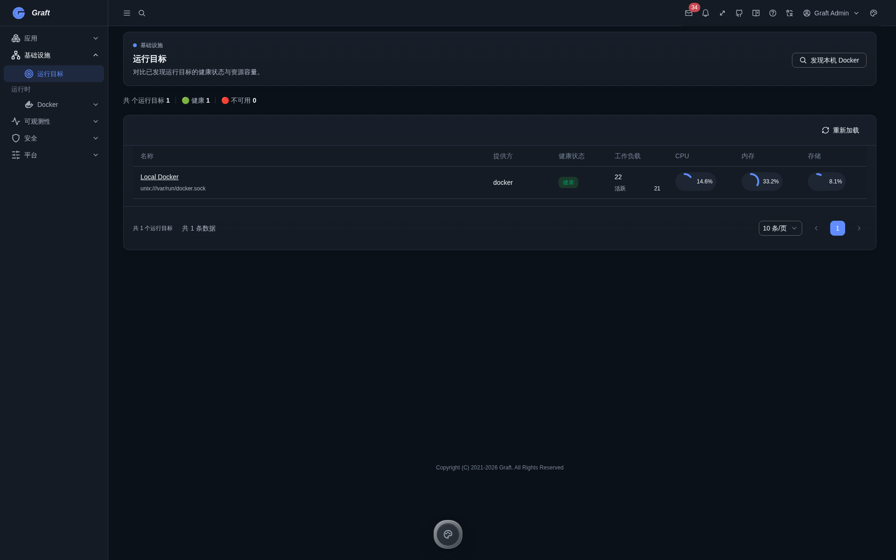
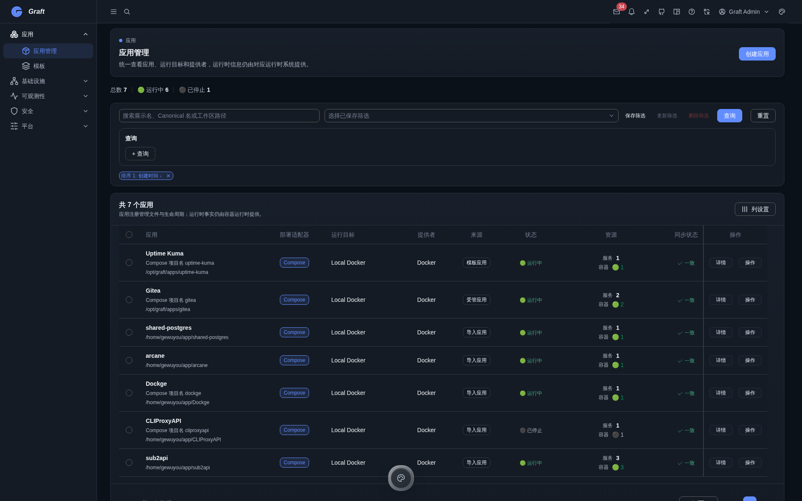
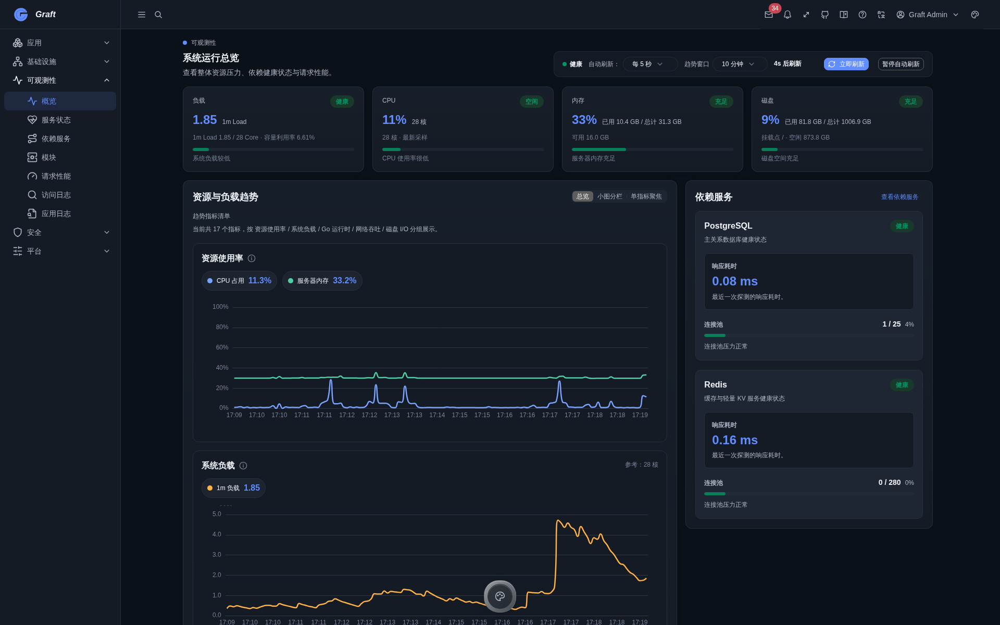
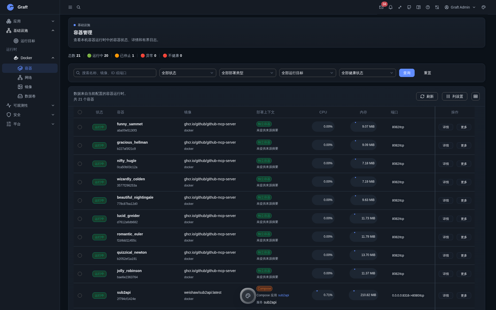

<p align="center">
  
</p>

<h1 align="center">Graft</h1>

<p align="center"><strong>一个自托管的应用平台。</strong></p>

<p align="center">在一个界面中管理 Compose 应用、Docker 运行时，以及围绕它们的运维信号。</p>

<p align="center">
  <a href="https://github.com/GeWuYou/Graft/tags"></a>
  <a href="LICENSE"></a>
  
  
</p>

<p align="center"><a href="README.md">English</a> · <a href="#快速开始">快速开始</a> · <a href="#文档">文档</a> · <a href="#参与贡献">参与贡献</a></p>



## Graft 是什么？

Graft 是面向 Docker 上 Compose 应用的自托管应用平台。它将应用记录、运行目标、容器资源与运维视图收敛到同一个管理界面，避免这些信息分散在多个工具中。

当前可执行的部署适配器是 Compose，当前运行目标是本机 Docker。这个边界是有意保持清晰的，Graft 不会把尚未交付的提供方写成已支持的集成。

## 核心能力

|                  |                                                                                   |
| ---------------- | --------------------------------------------------------------------------------- |
| **以应用为中心** | 将创建、导入、模板、配置、生命周期操作统一在 Compose 应用资源下。                 |
| **统一运行时**   | 关联本机 Docker 运行目标，查看容器、镜像、网络、卷、事件、日志和受控 Shell 会话。 |
| **可观测性**     | 查看运行时健康度、资源趋势、依赖、请求性能、访问日志、应用日志和审计事件。        |
| **OpenAPI 优先** | OpenAPI 3.1 是共享 API 契约，前端 API 类型从该来源生成。                          |
| **开发体验**     | Go 模块、Vue 3 管理壳、显式运行时装配与 Compose 部署让扩展路径保持可见。          |

## 为什么使用 Graft？

Graft 将 Docker 和 Compose 视为运行时能力，而不是产品边界。应用是管理单位，运行状态与可观测信息始终围绕应用关联。

| 层次       | 当前职责                                                       |
| ---------- | -------------------------------------------------------------- |
| **应用**   | Compose 应用记录、模板、生命周期操作、配置工作区和应用日志。   |
| **运行时** | 本机 Docker 发现、资源清单、运行时健康度、容器操作与实时信号。 |
| **平台**   | 认证、RBAC、审计、调度、通知、系统配置和 OpenAPI 契约。        |

## 快速开始

Graft 在 GHCR 发布 server 与 web 镜像。需要一台已安装 Docker Compose 的主机。

```bash
git clone https://github.com/GeWuYou/Graft.git
cd Graft
cp compose.env.example .env
# 在 .env 中为 POSTGRES_PASSWORD 和 GRAFT_AUTH_JWT_SECRET 设置强密码。
# GRAFT_IMAGE_TAG 选择 server/web 共用的官方镜像版本：latest、beta 或固定发行版本（例如 v1.2.3）。
docker compose pull
docker compose up -d
```

打开 [http://localhost:3000](http://localhost:3000)。Compose 会启动 PostgreSQL 与 Redis，通过一次性 bootstrap 服务执行数据库迁移，再启动 server 和 web 服务。

首次登录使用默认管理员凭据 `graft` / `graft-admin`。Graft 会要求先修改这组初始化密码，之后才能进入管理后台。

本地开发使用源码入口：

```bash
# 终端 1
cd server
go run ./cmd/graft dev

# 终端 2
cd web
bun run dev
```

部署到非本机环境前，请阅读[部署配置模板](compose.env.example)与 [Compose 拓扑](compose.yml)。`GRAFT_IMAGE_TAG` 是官方 server 与 web 镜像唯一共用的版本配置，可使用 `latest`、`beta` 或固定发行版本。对 `latest` 和 `beta`，runner 只在本次升级中使用由 manifest 推导出的发行目标，`.env` 中的跟随标签保持不变。固定 Tag 升级会以原子方式写入同一频道中较新的已验证固定 Tag，并仍会校验拉取镜像的 digest。已有实例在启用受控升级前可参考[官方 Compose 迁移指南](docs/official-compose-migration.zh-CN.md)。

## 界面预览

### 应用管理



### 可观测性



### 容器



## 文档

- [项目设计](ai-plan/design/architecture/项目设计.md)：平台边界与模块化架构。
- [模块与依赖注入设计](ai-plan/design/architecture/模块与依赖注入设计.md)：运行时组合方式。
- [前端架构](ai-plan/design/architecture/前端架构设计.md)：Vue 管理壳和模块归属。
- [OpenAPI 契约](openapi/openapi.yaml)：HTTP API 的权威描述。
- [官方 Compose 迁移指南](docs/official-compose-migration.zh-CN.md)：受控升级需要满足的部署要求。
- [MVP 实施计划](ai-plan/roadmap/MVP实施计划.md)：当前已批准的平台范围。

## 路线图

Graft 当前专注于完善并稳固已有的应用、运行时、可观测性和平台闭环。后续工作记录在 [MVP 实施计划](ai-plan/roadmap/MVP实施计划.md) 中；本 README 只介绍仓库中已经具备的能力。

## 参与贡献

请先阅读 [AGENTS.md](AGENTS.md)，其中说明了仓库约定、启动规则与校验入口。默认的本地完成态校验命令是：

```bash
just check
```

也可以按范围执行：服务端使用 `cd server && go run ./cmd/graft validate backend`，前端使用 `cd web && bun run check`。

## 许可证

Graft 使用 [AGPL-3.0-only](LICENSE) 许可证。

## Star History

<a href="https://www.star-history.com/?repos=GeWuYou%2FGraft&type=date&legend=top-left">
  <picture>
    <source media="(prefers-color-scheme: dark)" srcset="https://api.star-history.com/chart?repos=GeWuYou/Graft&type=date&theme=dark&legend=top-left&sealed_token=bZsfuLebiyxvCHaxsmMnS0lBafr-7iguLkD4iWQe7CeLm1HSgvgjpWgYochrIVVfWYegBQ--p_ESH218NGe507pi7MawLenhJ2o4uTfAePVXSqOLKDVgJw">
    <source media="(prefers-color-scheme: light)" srcset="https://api.star-history.com/chart?repos=GeWuYou/Graft&type=date&legend=top-left&sealed_token=bZsfuLebiyxvCHaxsmMnS0lBafr-7iguLkD4iWQe7CeLm1HSgvgjpWgYochrIVVfWYegBQ--p_ESH218NGe507pi7MawLenhJ2o4uTfAePVXSqOLKDVgJw">
    
  </picture>
</a>
